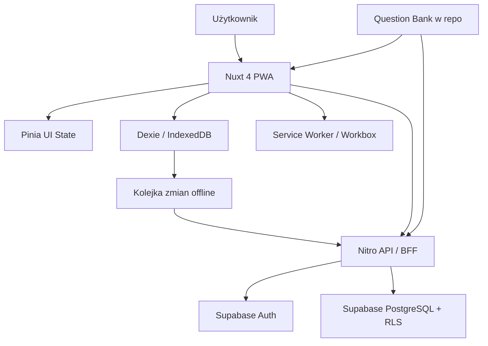

# Pełna Architektura Technologiczna - Veriffica

## 1. Podsumowanie architektury (Executive Summary)

Veriffica powinna zostać zbudowana jako modularny monolit Full-Stack oparty o Nuxt 4, z jedną bazą kodu, jednym językiem programowania i maksymalnie dużym udziałem usług zarządzanych. To daje najlepszy balans między time-to-market, kosztem utrzymania, wydajnością i wygodą pracy w modelu, w którym AI wykonuje większość implementacji, a Ty pełnisz głównie rolę nadzorczą.

Rekomendowany model docelowy:

- Frontend i aplikacja PWA: Nuxt 4 + Nuxt UI 4 + TailwindCSS 4.
- Warstwa API i logiki serwerowej: Nitro server routes w tym samym repozytorium.
- Auth i baza danych: Supabase Auth + Supabase PostgreSQL.
- Offline-first: Dexie.js na IndexedDB jako lokalny system zapisu i kolejki synchronizacji.
- Hosting i CI/CD: Vercel + GitHub Actions.

Ta architektura jest nowoczesna na warstwie DX i UI, ale celowo nudna w rdzeniu: TypeScript, REST, Postgres, SSR, PWA i managed services zamiast mikroserwisów, Kubernetesa, event busów czy osobnego backendu w drugim repo.

### Kluczowe wyzwania techniczne wynikające z PRD

| Obszar | Wyzwanie | Wpływ na architekturę |
| --- | --- | --- |
| Offline-first | Użytkownik ma móc pracować bez internetu i bez utraty danych | Potrzebny lokalny model danych w IndexedDB, kolejka zmian i jawna strategia synchronizacji po reconnect |
| Dynamiczny bank pytań | Widoczność pytań zależy od `Base + fuelType + transmission + drive + bodyType` oraz runtime flags | Źródło prawdy dla checklisty powinno być wersjonowane w repo, a nie budowane dynamicznie w bazie |
| Ścisła walidacja Part 1 | Silne reguły pól, normalizacja, walidacja między polami i odblokowanie Parts 2-5 | Wspólne kontrakty walidacyjne po stronie klienta i serwera, bez rozjazdu logiki |
| Smart Pruning | Zmiana konfiguracji auta może usuwać część odpowiedzi | Logika musi działać deterministycznie lokalnie, zanim dane zostaną zsynchronizowane |
| Bezpieczeństwo danych | Użytkownik może widzieć i edytować wyłącznie własne dane | Potrzebne RLS w bazie oraz serwerowa kontrola sesji dla operacji wrażliwych |
| Social login i ciągłość sesji | Google i Apple muszą działać także w modelu offline-resume | Auth nie może być spleciony z lokalnym stanem inspekcji; po reconnect sesja ma się odnowić bez utraty lokalnych danych |
| SEO i PWA | Landing page ma być publiczny i dobrze indeksowalny, aplikacja ma działać jak PWA | Potrzebny SSR/prerender dla strony publicznej oraz service worker dla zasobów aplikacji |

### Wymagania niefunkcjonalne

| Wymaganie | Priorytet | Wniosek architektoniczny |
| --- | --- | --- |
| Wydajność mobilna | Wysoki | SSR dla publicznych stron, lekkie komponenty, brak ciężkiego runtime CSS-in-JS, lokalny odczyt z IndexedDB |
| Skalowalność MVP | Średni | Architektura ma skalować się liniowo wraz z ruchem bez przejścia na mikroserwisy |
| Bezpieczeństwo | Wysoki | Supabase Auth, RLS, HttpOnly cookies, security headers, serwerowa obsługa delete i limitów biznesowych |
| Niski koszt utrzymania | Wysoki | Jedno repo, jedna aplikacja, mało vendorów, brak własnej infrastruktury kontenerowej |
| Szybkość wytwarzania | Wysoki | End-to-end TypeScript, silna integracja Nuxt z UI, auth i server routes |
| SEO | Średni | Indexowany tylko landing page; app routes jako `noindex` |
| Odporność offline | Wysoki | Dexie + IndexedDB jako źródło lokalnej prawdy dla danych użytkownika |
| Utrzymywalność | Wysoki | Kontrakty typów, schematy walidacji, wersjonowany question bank, testy smoke i e2e |

## 2. Szczegółowy stos technologiczny (Frontend, Backend, DB, Cloud, CI/CD)

### Frontend

| Warstwa | Rekomendacja | Rola | Dlaczego ta decyzja |
| --- | --- | --- | --- |
| Framework główny | Nuxt.js v4 | SSR, routing, layouty, middleware, server integration | Najlepsza synergia z preferencjami, świetne DX, dobry balans SEO + app shell + PWA |
| UI framework | Nuxt UI v4 | Gotowe komponenty formularzy, modali, kart, nawigacji | Przyspiesza development i dobrze współpracuje z Nuxt 4 oraz Tailwind 4 |
| Stylowanie | TailwindCSS v4 + CSS variables | Responsywny layout, theme tokens, font scale | Bardzo szybkie iterowanie z AI, mały koszt utrzymania, brak runtime CSS overhead |
| Zarządzanie stanem UI | Pinia | Lekki stan aplikacyjny: auth UI, preferences, ekran sesji, modale | Wystarczające dla Nuxt; prostsze niż wprowadzanie cięższych bibliotek do server-state |
| Trwały lokalny storage | Dexie.js na IndexedDB | Dane inspekcji, odpowiedzi, notatki, kolejka synchronizacji, preferencje offline | Spełnia PRD wprost i daje wersjonowane migracje po stronie przeglądarki |
| Formularze i walidacja | Nuxt UI Forms + Zod | Walidacja Part 1, komunikaty inline, kontrakty mutacji | Najlepszy kompromis między DX, czytelnością i współdzieleniem reguł klient/serwer |
| PWA | `@vite-pwa/nuxt` (Workbox) | Manifest, service worker, cache app shell i assetów | Standardowe i sprawdzone rozwiązanie dla PWA w ekosystemie Nuxt |
| Theme handling | `@nuxtjs/color-mode` + ustawienia użytkownika | System theme + ręczny override | Bezpośrednio odpowiada na wymagania motywu systemowego i ustawień użytkownika |
| Utility composables | `@vueuse/nuxt` | Online/offline status, local preferences, ergonomia reactive API | Zmniejsza ilość kodu własnego w typowych scenariuszach |
| Wykresy Summary | Własne lekkie komponenty SVG | Prosty rozkład `Yes / No / Don't know` | Dla MVP ciężka biblioteka chartowa byłaby zbędnym narzutem |

### Backend & API

| Warstwa | Rekomendacja | Rola | Dlaczego ta decyzja |
| --- | --- | --- | --- |
| Architektura backendu | Modularny monolit / BFF | Jedna warstwa API między frontendem i backend services | Minimalizuje złożoność, idealne dla MVP i pracy sterowanej przez AI |
| Runtime serwerowy | Nitro server routes w Nuxt 4 | Endpointy API, operacje wrażliwe, integracja auth, sync orchestration | Jeden stack, jeden deployment, jedna konfiguracja |
| Język | TypeScript | Kod frontendu, backendu i kontraktów | Jeden język zmniejsza koszt poznawczy i ułatwia pracę z AI |
| Styl API | REST/JSON | CRUD sesji, sync, delete account, delete inspection | Czytelniejsze i lżejsze dla MVP niż GraphQL lub osobne RPC frameworki |
| Kontrakty API | Zod schemas + wspólne typy TS | Walidacja requestów i odpowiedzi, spójność klient-serwer | Redukuje ryzyko rozjazdu między frontendem i backendem |
| Silnik synchronizacji | Batch snapshot sync per inspection | Replikacja zmian offline do serwera po reconnect | Przy limicie 2 inspekcji prostsze i bardziej niezawodne niż event sourcing |
| Operacje biznesowe | Server endpoints + SQL/RPC helper functions | Limit 2 inspekcji, hard delete, account deletion, ownership checks | Reguły krytyczne nie mogą polegać wyłącznie na logice klienta |
| Background jobs | Brak osobnego job systemu w MVP | Synchronizacja inicjowana przez aplikację przy reconnect | Unikamy zbędnego narzutu operacyjnego; Safari i tak słabo wspiera pełny Background Sync |

### Baza danych

| Warstwa | Rekomendacja | Rola | Dlaczego ta decyzja |
| --- | --- | --- | --- |
| DBMS | Supabase PostgreSQL | System of record dla użytkowników i inspekcji | Relacyjny model lepiej pasuje do ownership, statusów, RLS i raportowania niż NoSQL |
| Model danych | Relacyjny rdzeń + selektywne JSONB | `profiles`, `preferences`, `inspections`, plus payload inspekcji w JSONB | Upraszcza sync i wersjonowanie przy zachowaniu zalet Postgresa |
| Model inspekcji | Jedna sesja = rekord + snapshot domenowy | Part 1, runtime flags, answers, notes, progress, score | Przy bardzo małym wolumenie per user minimalizuje liczbę joinów i koszt implementacji |
| Schemat checklisty | Artefakty statyczne w repo | `question-bank.json`, mapping config, schemas, TS contracts | PRD już wskazuje repo jako source of truth; nie warto robić z tego CMS-a w MVP |
| Migracje | Supabase CLI + SQL migrations | Zmiany schematu, RLS, funkcje SQL | Lepsze dopasowanie do Postgresa i RLS niż dokładanie ORM jako kolejnej warstwy |
| Typowanie bazy | Generowane typy TS z Supabase | Bezpieczne zapytania i DTO | Zmniejsza liczbę ręcznie utrzymywanych typów |
| Backup i recovery | Supabase backups + PITR na środowisku produkcyjnym | Ochrona danych użytkowników | Wystarczające i niskokosztowe dla MVP |

### Auth & Security

| Warstwa | Rekomendacja | Rola | Dlaczego ta decyzja |
| --- | --- | --- | --- |
| Uwierzytelnianie | Supabase Auth z Google i Apple OAuth | Logowanie social, sesje użytkownika | Szybki start, dobra integracja z Nuxt, brak potrzeby budowania auth od zera |
| Sesje | SSR cookies + silent refresh po reconnect | Bezpieczna sesja w online, płynne odnowienie po offline | Lokalny stan inspekcji nie zależy od chwilowej ważności tokenu |
| Autoryzacja | Postgres RLS + server-side session checks | Izolacja danych per user | Najważniejsze zabezpieczenie dla dashboardu, sesji i summary |
| Hard delete danych | Server-side orchestrated delete | Usunięcie konta i sesji wraz z danymi | Operacja wrażliwa nie powinna być wykonywana bezpośrednio z klienta |
| Limity biznesowe | Server-side guard + SQL transaction/function | Maksymalnie 2 inspekcje na konto | Zapobiega race conditions i obchodzeniu limitu po stronie klienta |
| Security headers | `nuxt-security` | CSP, HSTS, X-Frame-Options, itp. | Tani i skuteczny baseline bezpieczeństwa |
| Zarządzanie sekretami | Vercel env vars + Supabase secrets + GitHub Secrets | Bezpieczne przechowywanie kluczy i callback URLs | Standardowy i prosty model dla małego zespołu |
| Ochrona cache | Cache tylko dla statycznych assetów i public pages | Ochrona przed wyciekiem danych uwierzytelnionych | PWA nie może cache'ować prywatnych payloadów w publicznym cache przeglądarki |

### Infrastruktura & DevOps

| Warstwa | Rekomendacja | Rola | Dlaczego ta decyzja |
| --- | --- | --- | --- |
| Hosting aplikacji | Vercel | Deploy Nuxt 4, preview environments, prosty SSR | Bardzo szybki TTM i dobra integracja z Nuxt |
| Backend services | Supabase Cloud | Auth, Postgres, backup, SQL functions | Jeden vendor pokrywa kluczowe potrzeby backendu MVP |
| Runtime Node | Node.js 22 LTS | Spójne środowisko lokalne i CI | Stabilny baseline dla Nuxt 4 |
| Package manager | pnpm | Szybkie instalacje i deterministyczne lockfile | Dobre DX i niższy koszt CI |
| CI/CD | GitHub Actions + preview deploye na PR | Typecheck, lint, testy, schema validation, deploy | Wystarczające i standardowe dla jednego repo |
| Testy | Vitest + Playwright | Testy logiki domenowej i ścieżek krytycznych | Najlepszy koszt/jakość dla MVP web app |
| Monitoring operacyjny | Vercel Logs/Analytics + Supabase Logs | Podstawowe logi i metryki platformy | Zgodne z PRD: bez ciężkiego monitoringu typu Sentry na starcie |
| Product analytics | Faza 1.5: lekki event tracking do PostHog lub własnej tabeli eventów | Metryki sukcesu z PRD | Nie blokuje MVP, ale warto zaplanować wcześnie |
| Przechowywanie plików | Brak w MVP | Brak uploadów zdjęć/PDF | Nie dokładamy storage, dopóki produkt go nie potrzebuje |

## 3. Integracja i przepływ danych (Diagram logiczny opisowy)

### Przepływ logiczny

1. Pierwsza wizyta online ładuje publiczny landing page przez SSR/prerender oraz pobiera app shell i statyczny question bank do cache PWA.
2. Użytkownik loguje się przez Google lub Apple; sesja jest utrzymywana po stronie serwera i przeglądarki w modelu bezpiecznych cookies.
3. Po wejściu do strefy chronionej aplikacja najpierw czyta ostatni lokalny snapshot z IndexedDB, dzięki czemu dashboard i sesja mogą uruchomić się także offline.
4. Każda zmiana domenowa zapisuje się najpierw lokalnie do Dexie: Part 1, odpowiedzi, notatki, status sesji, progress i kolejka synchronizacji.
5. Gdy urządzenie odzyska połączenie, aplikacja wysyła batch zmian lub pełny snapshot inspekcji do Nitro API.
6. Nitro waliduje payload, sprawdza tożsamość użytkownika, wymusza reguły biznesowe i zapisuje dane do PostgreSQL.
7. Serwer zwraca stan kanoniczny z nowymi znacznikami czasu; klient rekoncyliuje stan lokalny i czyści zsynchronizowane elementy kolejki.

### Ważna decyzja architektoniczna

Synchronizacja powinna być oparta o snapshot inspekcji, a nie event sourcing. To świadome uproszczenie. PRD ogranicza użytkownika do maksymalnie 2 inspekcji, a payload jednej inspekcji jest względnie mały. Dzięki temu zyskujemy prostszy model konfliktów, mniej błędów i dużo krótszy czas implementacji.

## 4. Uzasadnienie wyborów i zgodność z preferencjami

### Dlaczego ten stack jest spójny z ekosystemem Nuxt.js

| Obszar | Decyzja | Efekt synergii |
| --- | --- | --- |
| App shell + SEO | Nuxt 4 SSR/prerender | Landing page jest szybki i dobrze indeksowalny, a część aplikacyjna może działać jako PWA |
| UI i stylowanie | Nuxt UI 4 + TailwindCSS 4 | Bardzo szybkie iterowanie interfejsu bez budowania design systemu od zera |
| Auth | Supabase module + Nitro | Mniej kodu integracyjnego, prostsze route guards i obsługa sesji |
| Offline data | Dexie poza Pinia | Pinia nie jest przeciążona dużym trwałym stanem; Dexie robi to, do czego jest stworzony |
| Walidacja | Nuxt UI Forms + Zod | Jedna logika walidacji może służyć formularzom i endpointom |
| PWA | Nuxt + Workbox | Naturalne domknięcie wymagań offline-first bez osobnej aplikacji mobilnej |

### Dlaczego to nie jest overengineering dla MVP

| Decyzja | Wybrano | Odrzucono | Powód |
| --- | --- | --- | --- |
| Backend | Nitro BFF w tym samym repo | Osobny NestJS / Fastify backend | Dwa repo i dwa deploymenty spowolniłyby delivery bez zysku dla MVP |
| Architektura systemu | Modularny monolit | Mikroserwisy | Za mały zakres domeny i zespół na koszt synchronizacji między usługami |
| API | REST/JSON | GraphQL | Zbyt duży narzut schematów i klienta jak na prosty model danych |
| DB | PostgreSQL + JSONB snapshot | Firestore / czysty dokumentowy NoSQL | Ownership, RLS i raportowanie są naturalniejsze w Postgresie |
| Sync | Snapshot sync | Event sourcing / CQRS | Zbyt skomplikowane dla małej liczby sesji per user |
| Wykresy | Własne lekkie SVG | Rozbudowana biblioteka chartowa | Potrzebujemy tylko prostych rozkładów odpowiedzi |

### Zgodność z preferencją pracy "AI robi większość, Ty nadzorujesz"

Ten stack jest bardzo dobry do pracy w modelu AI-assisted delivery, bo ogranicza liczbę miejsc, w których trzeba utrzymywać złożone kontrakty między różnymi technologiami.

- Jedno repozytorium oznacza mniej kontekstu do przekazywania AI.
- TypeScript end-to-end oznacza mniej strat na tłumaczeniu modeli między frontendem, backendem i walidacją.
- Supabase eliminuje konieczność ręcznej budowy auth, polityk sesji i dużej części boilerplate backendowego.
- Nuxt UI 4 i TailwindCSS 4 pozwalają AI generować spójny UI szybciej niż w podejściu custom CSS.
- Static question bank w repo ułatwia AI pracę na artefaktach źródłowych i zmniejsza ryzyko rozjazdu z PRD.

### Jak preferencje frontendowe zostaną zintegrowane bez utraty wydajności

- Nuxt 4 zapewnia route-based code splitting i SSR tam, gdzie ma to wartość biznesową.
- TailwindCSS 4 generuje tylko używane utility classes, więc nie produkuje ciężkiego arkusza stylów dla MVP.
- Nuxt UI 4 korzysta z przewidywalnego systemu komponentów i CSS variables, a nie z kosztownego runtime styling.
- Motyw i rozmiar czcionki mogą być trzymane jako lekkie preferencje użytkownika i lokalne ustawienia, bez komplikowania renderingu.
- Publiczny landing może być prerenderowany, a aplikacyjna część chroniona może działać jako dynamiczny PWA shell.

Krótko: nowoczesny frontend pozostaje szybki, bo ciężar logiki jest w SSR, code splittingu, lokalnym storage i prostych komponentach, a nie w nadmiarowej liczbie bibliotek runtime.

## 5. Plan rozwoju technicznego (Roadmapa technologiczna)

| Faza | Zakres | Rezultat |
| --- | --- | --- |
| Faza 0: Foundation | Bootstrap Nuxt 4, Nuxt UI 4, Tailwind 4, pnpm, GitHub Actions, Vercel, Supabase project, env management | Stabilny szkielet projektu i środowiska |
| Faza 1: Identity + Dashboard | Social login, route guards, RLS baseline, dashboard, create/delete inspection, limit 2 inspekcji, user preferences | Użytkownik może wejść do systemu i zarządzać sesjami |
| Faza 2: Domain Core | Part 1, normalizacja i walidacja, session title builder, runtime flags, question bank resolver | Poprawnie konfigurowana inspekcja i dynamiczny zestaw pytań |
| Faza 3: Inspection Runner | Fullscreen question cards, notes, explanations, progress, total score, summary editing | Główna wartość produktu działa end-to-end |
| Faza 4: Offline & Sync Hardening | Dexie schema, queue, reconnect sync, smart pruning, stale state reconciliation, PWA installability | Produkt działa wiarygodnie offline-first |
| Faza 5: Beta Readiness | Playwright flows, iOS Safari checks, account deletion, security review, backup drill, lightweight analytics | MVP gotowe do pierwszych realnych użytkowników |

### Kolejność implementacji zalecana dla AI-driven development

1. Najpierw ustabilizować kontrakty domenowe: Part 1 schema, inspection snapshot schema, question bank resolver.
2. Potem zbudować lokalny model danych w Dexie, zanim powstanie pełna synchronizacja.
3. Następnie domknąć auth i dashboard.
4. Dopiero potem implementować runner Parts 2-5 i Summary.
5. Synchronizację online traktować jako domknięcie lokalnie działającego systemu, nie jako pierwszy krok.

To podejście ogranicza ryzyko, bo większość logiki biznesowej może zostać zweryfikowana lokalnie bez zależności od backendu.

## 6. Szacowane koszty i ryzyka

### Szacowane koszty miesięczne dla MVP

| Pozycja | Szacunek | Uwagi |
| --- | --- | --- |
| Vercel Pro | ok. 20 USD / seat / miesiąc | Dla produkcyjnego SSR i preview deployów |
| Supabase Pro | od 25 USD / miesiąc | Auth, Postgres, backup i funkcje SQL |
| GitHub Actions | 0-20 USD / miesiąc | Zależnie od liczby buildów i testów e2e |
| Domena i DNS | 1-5 USD / miesiąc | Średniorocznie |
| Apple Developer Program | ok. 99 USD / rok | Wymagane do produkcyjnego Sign in with Apple |
| Monitoring dodatkowy | 0-20 USD / miesiąc | Opcjonalnie po becie |

Realistyczny koszt utrzymania MVP przy niskim ruchu: około 55-90 USD miesięcznie plus 99 USD rocznie za Apple Developer Program.

### Główne ryzyka architektoniczne

| Ryzyko | Wpływ | Mitigacja |
| --- | --- | --- |
| Konflikty offline/online w modelu LWW | Średni | Sync per inspection snapshot, znaczniki `client_updated_at`, ostrzeżenia o nadpisaniu przy rzadkich konfliktach |
| Zachowanie PWA na iOS Safari | Wysoki | Testować wcześnie na realnych urządzeniach; nie opierać synchronizacji wyłącznie o browser Background Sync |
| Błędy polityk RLS | Wysoki | Testy integracyjne polityk, code review dla SQL migrations, brak bezpośrednich operacji admin z klienta |
| Rozjazd question banku z kodem | Średni | CI walidujące JSON Schema, wersjonowanie artefaktów i jedno źródło prawdy w repo |
| Złożoność Apple Sign-In | Średni | Skonfigurować i przetestować callbacki na początku projektu, nie na końcu |
| Migracje IndexedDB | Średni | Dexie versioning, scenariusze upgrade testowane w Playwright |

### Finalna rekomendacja CTO / Solution Architect

Najlepszym wyborem dla Veriffica jest:

- Nuxt 4 jako full-stack shell aplikacji.
- Nuxt UI 4 + TailwindCSS 4 jako warstwa interfejsu.
- Nitro jako BFF i warstwa logiki serwerowej.
- Supabase jako backend managed: Auth + PostgreSQL + RLS.
- Dexie na IndexedDB jako lokalny storage i kolejka offline.
- Vercel + GitHub Actions jako hosting i delivery pipeline.

To rozwiązanie spełnia wymagania PRD, jest bardzo dobre dla MVP offline-first, minimalizuje liczbę decyzji operacyjnych i najlepiej wspiera model pracy, w którym AI produkuje większość kodu, a Ty zarządzasz jakością, kierunkiem i akceptacją zmian.